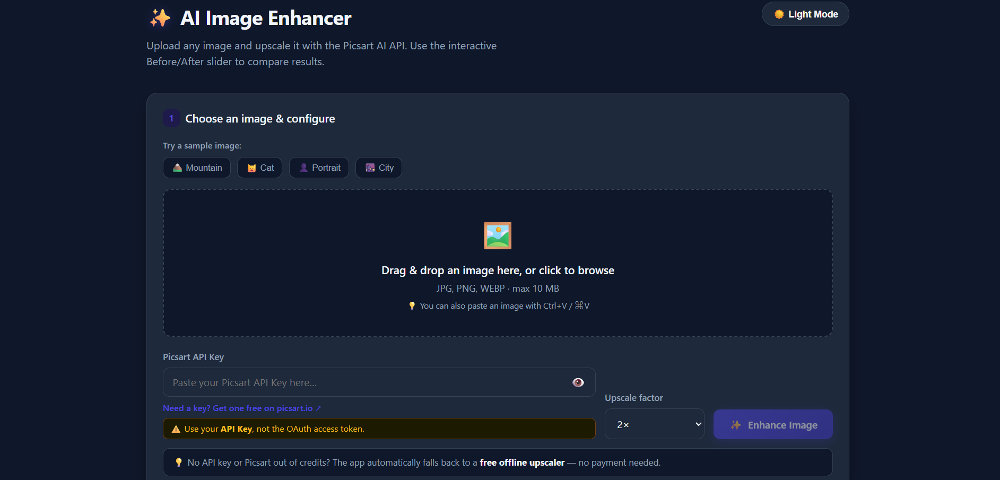
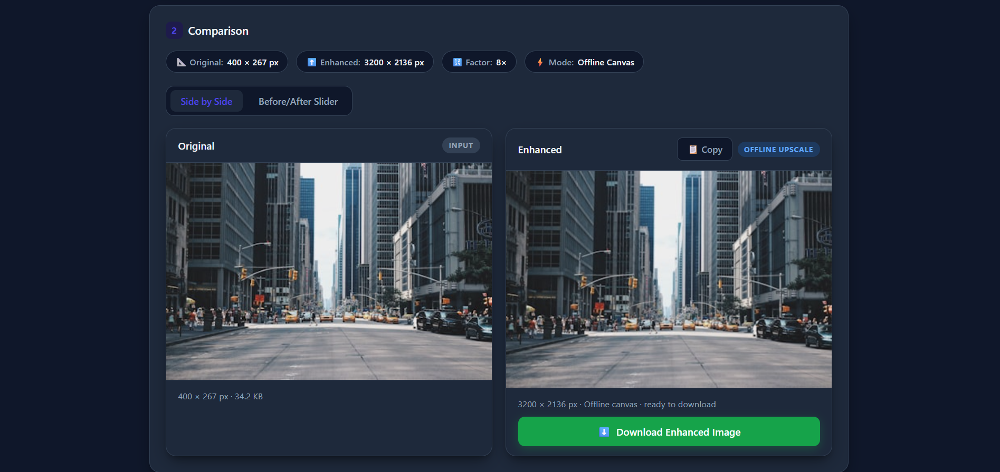

# ✨ AI Image Enhancer

A modern, responsive web application that enhances and upscales images using the Picsart AI API, with a free offline fallback powered by HTML5 Canvas.

The application provides an easy-to-use interface for uploading images, choosing an upscale factor, comparing the original and enhanced images, and downloading the result.

---

## 🚀 Features

- ✨ AI image upscaling using the Picsart Upscale API
- 🔍 Supports 2x, 4x, and 8x upscaling
- ↔️ Interactive Before/After comparison slider
- 🆓 Free offline fallback when an API key is unavailable
- 🌙 Dark / Light mode
- 📤 Drag-and-drop image upload
- 📋 Paste images directly from the clipboard
- 🖼️ Built-in sample images for quick testing
- 📐 Displays image dimensions and enhancement information
- 📋 Copy enhanced image to clipboard
- ⬇️ Download enhanced images as PNG
- ⚡ Zero dependencies and no build process required
- 📱 Responsive and modern user interface

---

## 🛠️ Technologies Used

- **HTML5**
- **CSS3**
- **JavaScript (Vanilla JS)**
- **HTML5 Canvas**
- **Picsart AI API**

---

## 📸 Screenshots

### Main Interface

### Before & After Comparison

---

## ▶️ Getting Started

### Run Locally

No installation or build process is required.

1. Clone the repository:

    git clone https://github.com/anshumanray111-oss/AI-IMAGE-ENHANCER-PROJECT.git

2. Open the project folder.

3. Open `index.html` in a modern web browser.

That's it!

### Run Using a Local Server

You can also run the project using a local development server.

#### Python

    python -m http.server 8000

Then open:

    http://localhost:8000

#### Node.js

    npx serve .

---

## 🔑 Picsart API

The application can use the **Picsart AI API** for image enhancement and upscaling.

Get a Picsart API key from:

https://picsart.io/developers

### Using the API Key

1. Get your Picsart API key.
2. Open the application.
3. Paste the API key into the **Picsart API Key** field.
4. Select the desired upscale factor.
5. Click **Enhance Image**.

> ⚠️ **Important:** Use your Picsart **API Key**, not an OAuth access token.

### No API Key?

No problem.

The application automatically falls back to a **free offline upscaler** using HTML5 Canvas when an API key is not provided or the API cannot be used.

---

## 🌐 Deploy to GitHub Pages

This project can be deployed for free using GitHub Pages.

1. Push the project to GitHub.
2. Open the repository **Settings**.
3. Select **Pages**.
4. Under **Build and deployment**, select:
   - **Source:** Deploy from a branch
   - **Branch:** `main`
   - **Folder:** `/ (root)`
5. Click **Save**.

After GitHub Pages finishes deploying, your application will be available through your GitHub Pages URL.

---

## 📁 Project Structure

    AI-IMAGE-ENHANCER-PROJECT/
    ├── index.html
    ├── README.md
    ├── .gitignore
    ├── .gitattributes
    └── LICENSE

---

## 🔒 Privacy

When the Picsart API is used, the selected image is sent to the Picsart API for processing.

When the offline fallback is used, image processing happens directly in the browser.

Please avoid uploading sensitive or private images when using third-party API services.

---

## 📄 License

This project is licensed under the **MIT License**.

---

## 👨‍💻 Author

**Anshuman Ray**

GitHub:

https://github.com/anshumanray111-oss

[def]: SCREENSHOTS/main-Interface.png